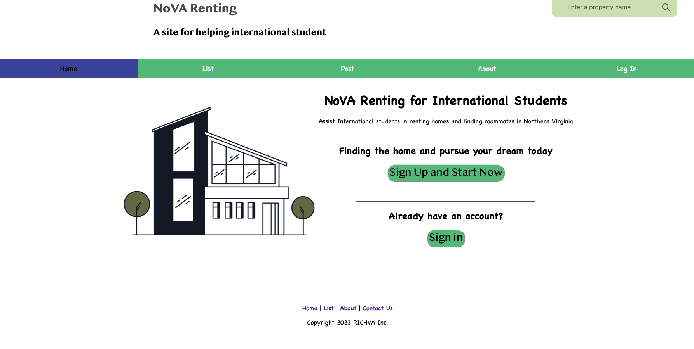
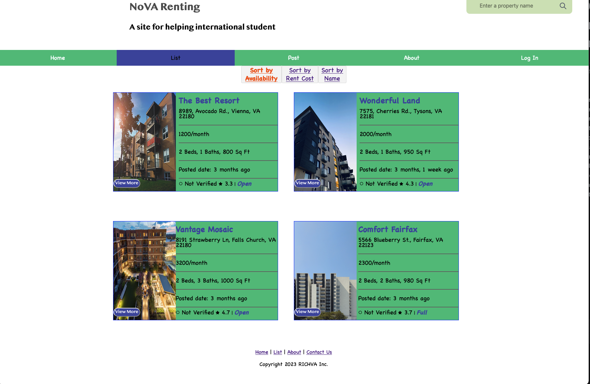
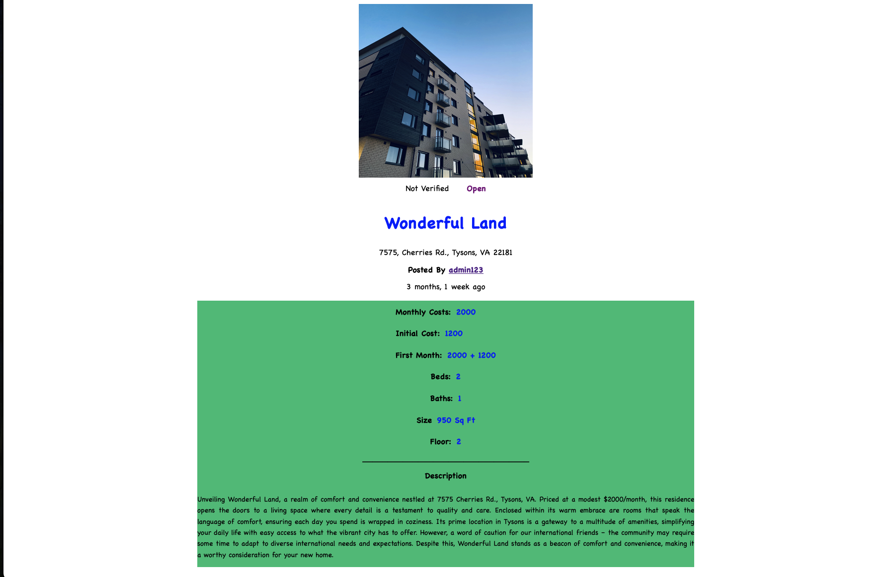
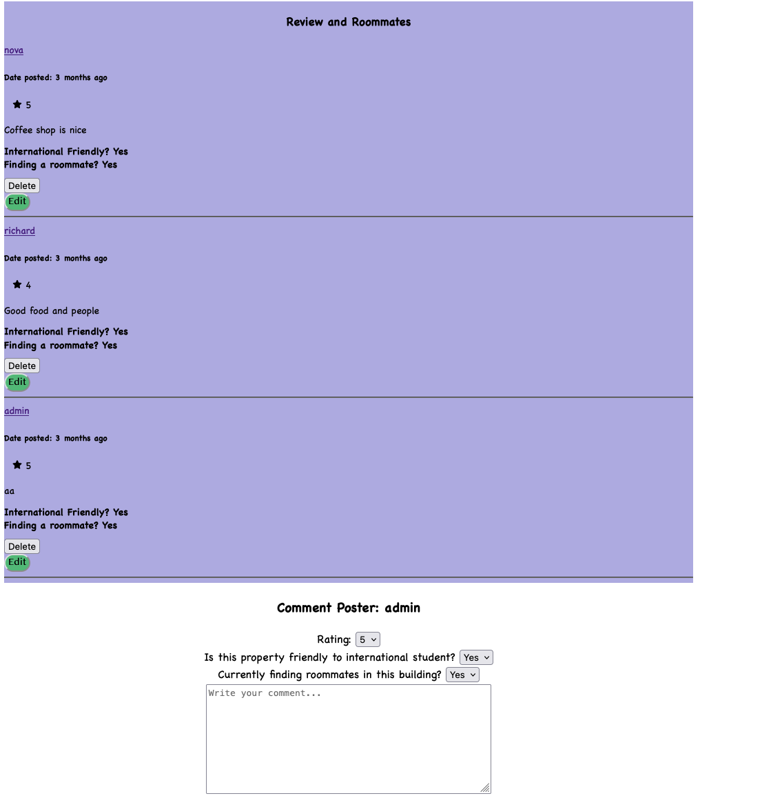
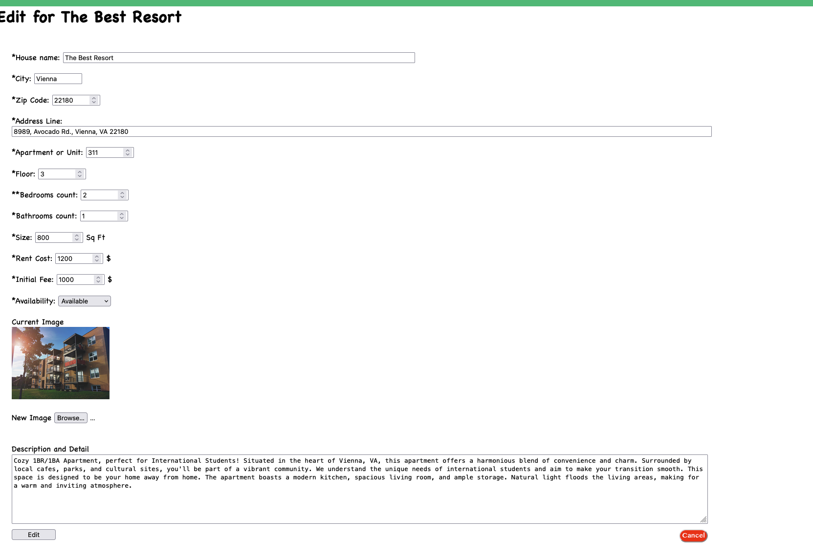
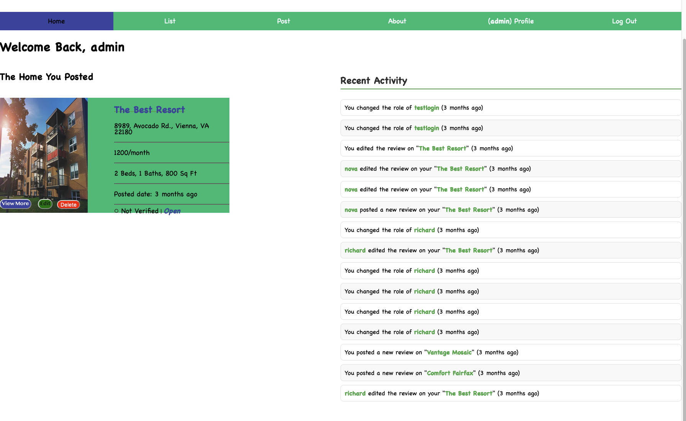
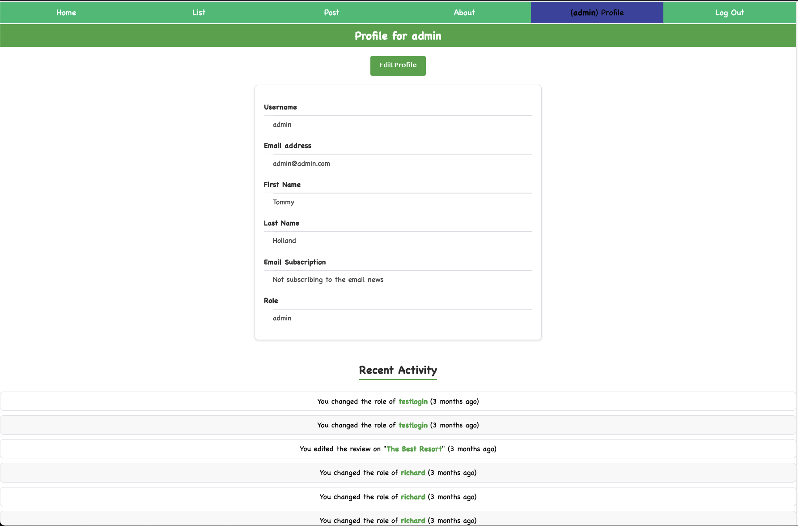

# NOVA-Renting-Django
This is an app to assist International students in renting homes and finding roommates in Northern Virginia.  The intended audience will be international students trying to rent a home or find roommates in Northern Virginia. This platform can help them find an apartment willing to have international students.

## Website Screenshots


```html







